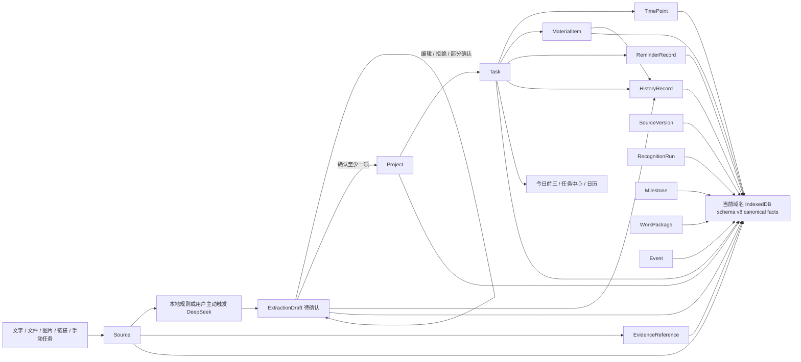

# 学生事务管家架构与数据流

## 运行边界

浏览器负责界面、本机文件文字提取、规则解析、确认、任务管理和 IndexedDB 持久化。Cloudflare Worker 同时提供静态资源和同源 `/api/deepseek*` 代理；只有 Worker Secret 已配置且真实请求成功时，页面才可显示 DeepSeek 已连接。

## 信任规则

- 自动分类、日期、耗时、材料和优先级永远是建议；确认前不会创建任务。
- 外部文本是不可信数据，只作为文本显示，不执行 HTML、脚本或其中的指令。
- 文件本体、图片、PDF 二进制、API Key 和同步令牌不会进入 IndexedDB 或 JSON 备份。
- 云端整理最多发送当前用户主动提交的 24,000 字；知识问答最多发送问题和 4 条本地命中摘要。
- 无账号系统意味着没有自动跨设备同步，也意味着公开 AI 代理只有基础防滥用，不是用户级鉴权。

## 能力状态

| 能力 | 状态 | 说明 |
|---|---|---|
| 文本、TXT、Markdown、PDF 文本层 | 可用 | 浏览器本机读取，20 MB 上限 |
| 图片、扫描 PDF OCR | 未接通 | 保存来源后人工补充原文 |
| 本地规则拆分与确认 | 可用 | 结果只作为建议 |
| DeepSeek V4 Flash | 需配置 | Cloudflare Secret + 同源 Worker；失败回退本地规则 |
| 浏览器通知 | 有限可用 | 用户授权且页面保持打开 |
| 邮件 | 需本机服务配置 | 生产 Cloudflare 未部署邮件队列服务 |
| 网页变化 | 本机比较可用 | 后台抓取与实时监测未接通 |
| 微信 | 未接通 | 只显示官方审批与授权前置条件 |
| 跨设备同步 | 未接通 | 无账号、设备管理或受信任云后端 |
| Obsidian | 快照导出可用 | ZIP 或用户授权文件夹，不是自动同步 |

## 主要依赖许可证

| 依赖 | 当前版本 | 许可证 |
|---|---:|---|
| React / React DOM | 18.3.1 | MIT |
| Lucide React | 0.468.0 | ISC |
| PDF.js | 6.2.108 | Apache-2.0 |
| Vite / Vitest | 6.4.3 / 3.2.7 | MIT |
| Wrangler | 4.118.0 | MIT OR Apache-2.0 |

大版本升级必须在独立分支完成兼容性验证，不因 `npm outdated` 机械升级。
