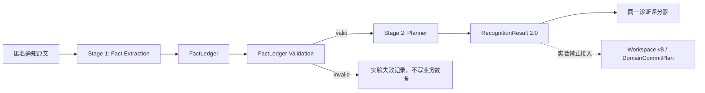

# E2.5 D3：显式 FactLedger Contract

## 定位

FactLedger 是 E2.5 隔离实验中的可验证中间表示，只回答“原文明确说了什么”。它不是 Workspace v8 实体、不是新的业务数据库，也不能直接进入 DomainCommitPlan。

Planner 才回答“这些事实如何组织为 Project、Milestone、Task、Material、TimePoint 和 Event”。

## Contract

实现位置：

- `src/recognition/e2/factLedger/types.ts`
- `src/recognition/e2/factLedger/validation.ts`

Schema：`e2.5-fact-ledger-1.0.0`。

### obligation

- `actor`：原文明示的责任主体；未明示为 `null`，不得默认虚构。
- `modality`：required / conditional / optional / prohibited / informational。
- `actionPredicate`：原文明示动作，如“回复”“提交”“携带”。
- `object`：动作对象。
- 通过 ID 关联 material、time expression、event、condition、constraint 和 evidence。

### material

Material 角色分为 deliverable、required_input、carry_item、reference。reference 不得自动变为必交材料；Material 被发现也不自动代表对应 Task 已被规划。

### time expression / time role

原始时间短语与其角色分开保存。角色包括 registration/submission/task deadline、planned start、event start/end、result announcement、superseded deadline 等。

relative、vague、unknown 必须保持 `normalizedValue=null`、`needsConfirmation=true`；精确区间必须有 start/end；更正通知通过 `supersedesTimeExpressionId` 表达旧/新关系。

### event

Event 只表示发生的会议、面试、培训、答辩、讲座等；不能吞掉“签到”“提交”“回复”等可完成义务。

### condition / constraint / modality

- condition：eligibility、prerequisite、trigger、exception、sequence。
- constraint：format、naming、quantity、channel、location、dependency、other。
- “仅入围者”“培训通过后”“学生只负责第一步”“暂定”等必须在事实层保留，不由 Planner 猜回。

### ambiguity

Ambiguity 使用稳定 `code`、目标事实 ID、解释和逐字证据。说明文字不是身份；同义描述可通过 code + target + evidence 匹配。

### evidence

每个事实必须至少引用一段逐字 evidence。Evidence 带 source 字符偏移，验证器要求 `sourceText.slice(start, end) === quote`。不允许模型改写文本冒充证据。

## Validation

纯验证器当前检查：

- schema 版本；
- 全局 ID 唯一；
- obligation 有 action predicate + object；
- 每个事实有逐字证据；
- evidence span 与原文完全一致；
- 所有跨事实引用有效；
- 相对/模糊/未知时间无假精度；
- 精确区间同时有起止值。

验证器只发现问题，不修复事实，不写 Workspace。

## Planner 输入/输出

Planner 输入只包含已经通过验证的 FactLedger、固定参考时间和固定规划指令。Planner 输出仍为现有 `RecognitionResult 2.0`，并继续通过现有 schema 校验和相同诊断 scorer。

Planner 允许：

- 在等价约束内合并/拆分 Task；
- 组织 Project/Milestone/WorkPackage；
- 将 Material、TimePoint、Event 与 Task 建立关系；
- 基于 FactLedger 标记 strong inference，但不能制造 Ledger 中没有的新事实。

Planner 禁止：

- 补造 actor、action、object、material、time、event、condition 或 constraint；
- 把 reference Material 变为 required；
- 把 Event 代替义务 Task；
- 把 relative/vague 时间变成未经证据支持的精确值；
- 写入 Workspace v8 或调用 DomainCommitPlan。

## 隔离边界

- 没有任何生产模块 import `src/recognition/e2/factLedger/**`。
- 不修改 `src/recognition/pipeline.ts`、Cloudflare Worker 默认路由或 Capture/Commit 链路。
- D4 Harness 必须通过显式诊断命令调用，不存在环境开关把它设为生产默认。
- FactLedger 结果只进入 Git 忽略的实验缓存；提交结果只保存匿名汇总和逐例诊断。
