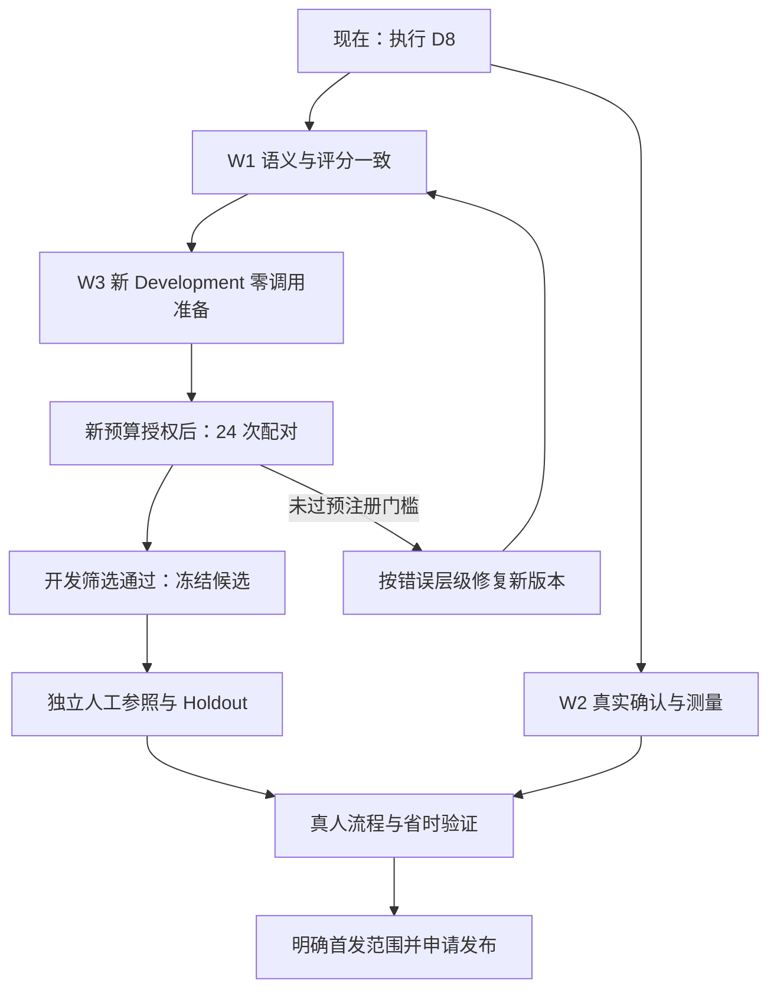

# 学生事务管家：从当前阻断到可用产品的执行路线

制定日期：2026-09-27。规划起点：`2a19b65eea51f7bd39ed7bff13264997bf8030bf`，本地/upstream/远端一致，工作区干净。当前分支为 `codex/e2-candidate11-blind-eval`。本文件细化现行 PRD 的工作顺序、责任和验收，不覆盖冻结实验或另设发布标准；本轮只制定计划，没有执行下列产品改造、调用或真人研究。

## 1. 你现在先做什么

下一项工作是执行 **D8：评分契约修复 + 确认/测量闭环 + 新 Development 零调用准备**。这三个相依部分放进一个连续工程任务，中间按清晰交付边界提交推送。现在不需要更换模型、重新设计全部 PRD，也不需要另建 Git 分支。

继续使用：

- 工作区：`C:\Users\Winner\.codex\worktrees\student-affairs-candidate11\比赛`。
- 分支：`codex/e2-candidate11-blind-eval`。
- 执行依据：[D8 完整提示词](NEXT_STAGE_EXECUTION_PROMPT.md)。
- 当前事实：[CURRENT_CONTEXT](../recognition-optimization/CURRENT_CONTEXT.md)。
- 实际漏洞：[复查与反例](review-20260927-r2/REVIEW_AND_ACTIONS.md)。

你只需发出文末的 D8 启动指令。普通本地设计、实现、测试、修复和提交由 Codex 连续完成；到本批模型调用、实际人工材料或发布边界再提供对应决定。旧 D6 许可不能充当新批许可。

## 2. 当前已经有了什么，还缺什么

| 已有基础 | 当前缺口 | 对推进的影响 |
|---|---|---|
| 独立工作区、版本化候选、历史 raw 与账本 | Candidate14 的评分契约不一致 | 不能可信地决定新候选更好 |
| 来源依据、公共 adapter、时间规则 | 独立事件时间字段漏检，部分语义未裁决 | 表面完整的答案可能仍有关键错误 |
| 任务/无任务处置、保存读回工程代码 | 当轮真实浏览器关键路径尚未验收 | 不能说实际页面闭环已经达标 |
| 首次快照及测量模块 | 阅读计入修改、批量纠正可能漏记 | 不能可信计算修改负担 |
| 新 PRD/AGENTS、分层检查与资源目录 | D8 修正尚未实现 | 现在应进入工程，不再反复重写治理 |
| Development 经验与人工模板 | 新独立人工参照、合法真人试次均缺 | 不能给出真人正确处置率和省时成绩 |

Candidate13 的旧拒绝结论、D7 阻断和 R4/R5 身份失效都保持。新版本改善必须有新证据，不改旧成绩。四项真人指标当前仍不可观测。

## 3. 总路线与依赖



W1/W2 可以交错推进，但评分正确以前不做新付费比较；真人研究依赖正确的测量和可用的页面。浏览器通道故障不阻止不依赖它的语义代码、身份准备或文档，不能因此把页面验收记为通过。

## 4. 四项指标怎样真正得到提升

| 指标 | 计算口径 | 优先工程抓手 | 哪个阶段才能有相应证据 |
|---|---|---|---|
| 首次整份建议正确率 | 首次输出整份正确来源数 / 全部计划合法来源；失败不删除，部分参照不算完整正确 | 修否定、条件、动作对象、时间、材料及修订；先修评分漏洞 | 开发对比有开发证据；独立 Holdout 才有相应未见质量证据 |
| 正确处置率 | 正确确认或正确无任务归档且读回一致 / 全部已开始合法试次 | 局部编辑、缺项提示、无日期保存、失败恢复、幂等 | 获准的实际真人操作与独立语义判断 |
| 低修改正确处置率 | 正确处置且无实质语义纠正 / 同一全部试次分母 | 首次建议少错少漏；正确记录字段纠正与批量保存关系 | 真人试次；不能用“点了确认”替代 |
| 主动修改时间 | 按预注册交互规则累计编辑活跃区间，同时报阅读/等待/总耗时 | 原文定位、就地修改、减少重复填写，可靠计时 | 真人事件；自动化毫秒数不能代替 |

同时列出放弃、超时、语义未判定、仪器缺失及样本量。正确率提高却耗时大幅增加，或少输出导致用户补录增加，都不能直接判为净改善。低修改的主口径仍为“无实质语义纠正”，不能临时改成“最多改三次”。

## 5. D8 第一部分：W1 修语义与评分

### 做什么

1. 建立原文义务→Prompt 要求→wire 字段→公共 adapter→参照→评分→页面处置的对应表。每行注明完整可测、只检查引用、歧义或表达缺口。
2. 统一无任务来源 informationScopeIds 的允许集合；模型按提示词输出时必须存在合规满分路径。
3. 独立事件时间逐项核对 type、normalizedValue、timezone、precision、isAllDay、needsConfirmation 与关联对象；任务时间和事件时间采用一致含义。
4. 区分“提交 PDF”中的格式、“收到审核通过才办结”中的完成标准，以及“月底另行通知”中的公布安排与未知截止。
5. 保留条件 true/false/unknown；按动作对象识别取消/替代的多个端点；检查不得因更保守而漏掉原文明示任务。
6. 为合理别名、顺序和拆合定义可接受规则，不为某个候选回答定制答案。原文确实歧义时给出 provisional 裁决或未决项。
7. 对正确样例做单字段变异：只改时区、只改时间类型、只改对象、只改条件等；错误必须失败。保持含义的改写应仍通过。

### 代码与交付

只读参照现有 `scripts/candidate14-reference-contract.mjs`、`scripts/score-candidate14-contract-v5.mjs`、`src/experiments/candidate14/commonAdapter.ts` 与 `timePolicy.ts`。被 D7 冻结的文件不原地改；另建新版本并记录依赖关系。没有必要新造第二套工作区 Schema。

交付一份对应表、一套新版语义/评分实现、可复算的正反例结果、未支持字段清单。全部为工程证据；人工标签缺失不妨碍修代码。

### 怎样算通过

每类拟作为“完整参照”的场景有合法正确输出可走通真实 Schema→adapter→scorer；关键变错不能仍获整份 PASS；两臂同样处理；完整和部分覆盖分开。若 wire 不能表达关键义务，提交具体兼容方案与影响，停止该部分晋级，不用隐式字段或假满分绕过 Schema 边界。

## 6. D8 第二部分：W2 修真实确认和测量

### 用户路径

在独立端口和独立数据库使用真实产品组件，验证：来源打开→建议摘要→点字段定位原文→编辑/拒绝/部分确认→保存→独立读回→刷新恢复。另测纯信息归档、无日期任务、保存失败后的继续、重复点击不重复创建。原 6633/6634 入口和旧库保持。

“全部拒绝”不自动代表正确无任务；部分确认不自动算整份正确处置；没有截止不能凭空补日期；重识别不能覆盖已确认内容。

### 测量修正

| 事件链 | 新版必须做到 |
|---|---|
| 展示后读 10 秒，没有编辑 | 不再把 10 秒称为编辑；阅读或不可判定状态单列 |
| 改时间后统一保存 | editId 显式归入 commitId，读回能对应到该批改动；缺映射不能写零修改 |
| 多字段编辑后一次提交 | 保存一次不等于只纠正一次，记录具体语义改动；不要按键盘次数算实质修改 |
| 修改后撤销 | 保留已付出的操作时间；最终净差异不能抹去中途工作量 |
| 失败、放弃、超时 | 保留此前编辑负担和终止状态；不从分母删除 |
| 隐藏、等待、暂停、空闲交叠 | 按一致规则划分，不重复加减；未闭合区间标缺失 |
| 重复事件、刷新恢复、首次快照 | 去重并核对归属；首次答案不可由最终编辑答案覆盖 |

交互日志测到的是“按操作规则定义的时间”，不能直接观测人的思考。实现前固定编辑区间、空闲截断和恢复定义，明确何时可识别阅读、何时只能记未知；在真人试次前锁定。先确保事件来自真实 UI，再验证公式，不能只有脱离页面的模拟测试。

### 交付与验收

交付可操作的隔离入口、新版事件与测量模块、事件到指标的工程复算、浏览器操作/读回/刷新证据。工程回放始终排除在真人汇总之外。页面或浏览器工具仍受阻则记录原始错误和最短恢复步骤，受影响的体验验收保持 NOT_RUN。

## 7. D8 第三部分：W3 修候选并准备下一批

按 W1 的错误分布做最小必要候选修正，更新候选版本与 promptVersion。候选编号由实现时的实际版本决定，不为换编号重做全部工作；默认候选不变。

以 12 份匿名 Development 来源覆盖以下组合：单/多任务、true/false/unknown、材料共享、精确/模糊/未说明时间、完成标准、依赖、禁止/背景、纯信息/事件、多端点取消/替代。场景可重叠；至少两份多端点修订来源。允许已见开发资料，明确来源、作者、已见程度和模型辅助情况，不称为独立 Holdout。

每份参照在冻结前完成可表达性与正反例检查。两臂比较 Candidate03 与新候选，共 12×2=24 个身份，6 AB/6 BA。模型路由、temperature、reasoning、referenceTime、timezone、Schema、输出上限与公共处理固定；不能让 Expected 进入请求。

开发筛选继续采用当前 D8 草案中的门槛，正式运行前绑定新 Manifest：

1. 24 个逻辑单元均有确定结局。
2. 两臂各 12/12 Schema 与引用有效。
3. 新候选 Severe、Forbidden、教学例泄漏均为 0。
4. 相对 Candidate03 不增加任务 FN 或关键字段 Major。
5. 整份正确来源至少净增 2。对 12 份数据这相当于差值至少 2/12，仅是开发筛选要求，不是预期成绩或统计泛化保证。

同时冻结失败处理、零重试/repair/verifier、停止规则与预算卡草案。所有身份为 dispatchAuthorized=false、NOT_RUN；不创建 grant，不写账本，不沿用 R4/R5 身份或旧 24 次许可。

这部分的交付是一个可信、可审查的请求包。没有完整参照或公平两臂链路，就交付具体缺口，不凑一个“可调用”状态。

## 8. 下一次真实 Development 对比

你在看到新请求包后，只需确认该批 Manifest、模型、24 次上限、费用硬上限及执行范围。执行前重新只读核验官方价格、路由、请求、账本和最坏费用；本计划不引用上次 1 美元额度作为新许可。

Codex 在授权范围内完成执行器复核、按请求顺序一次发送、reserve/raw/settle/真实 usage、冻结评分、错误差异和逐来源胜平负。发送或计费不确定时停止相关派发，不重发猜测。实际费用不可见写 NOT_OBSERVABLE，预算上界另列。

输出应先回答：整份正确分别几份/12？关键漏项有没有增加？时间、条件、材料和修订分别差在哪？哪些错误仍需要用户改？四项真人指标此时依然不能从模型回答直接得出。

| 结果 | 下一步 |
|---|---|
| 通过全部冻结开发门槛 | 冻结候选与规则，准备独立人工质量验证 |
| 任一门槛不满足 | 保留拒绝结论，按错误所属层修复新版；不自动多跑一批 |
| 发现评分器本身有错 | 原结论保留，追加诊断；新评分另存，正式再比较需新运行版本与授权 |
| 只提高 F1，整份正确没改善 | 不视为达到主目标，优先查同一来源残留的关键错误 |

## 9. 独立人工参照与小规模 Holdout

现在可以安排人员角色和准备空白表单，不必立即采集/共享真实材料。实际材料处理须有来源许可和对应授权。候选及规则冻结后，接入开发者未见的独立资料。

建议沿用已有 12 份独立 Holdout 的小规模设计，另建新包；两臂共 24 个请求需另一批授权。它提供所声明样本范围的独立证据，不替代未批准的全范围商业验证。

执行顺序：

1. 确定真实标注者 A 和复核者 B，记录与本批答案/教学材料的接触情况；有答案污染者不担任该批盲标角色。
2. 准备匿名来源和口径，不提供候选回答、教学答案或评分成绩。
3. A 完成义务和事实参照，B 先按原文形成自己的判断，再对差异复核；保留原始标注与修订记录。
4. 对歧义依据原文、明确口径或合法来源澄清裁决；不能因为某候选这样回答就认定其正确。无法解决的项在派发前标为部分/未决，不能充完整真值。
5. 检查来源重合、完整性、证据范围、版本、签名与来源权限；参照封存，候选与评分器不能在查看新答案后调整。
6. 固定运行和选择协议，再取得对应调用授权、执行和分析；不随结果改变样本或门槛。

没有真实独立人员时停在标签等待状态，本地工程、界面和读取专项仍可继续。模型可帮助准备模板，不能签为独立人工。

工具优先用现有空白模板。多人协作确实困难时才在 Label Studio / Doccano 中选一个，先验证导出和权限隔离；不为筹备研究同时部署两个平台。

## 10. 真人验证：测用户是否真的少改、少花时间

### 建议的探索规模

第一轮建议 8—12 名目标用户，每人处理 6 份通知，共 48—72 个实际任务试次；这是待注册的探索设计，不是已获招募授权、统计功效结论或正式商业样本量。先用独立于正式研究的小样本检查流程与仪器，再锁定研究方案。若你需要对外宣称稳定的百分比改善，应根据试点差异、用户内相关性和所需精度设计后续规模。

### 公平安排

- 同一名用户不重复看到同一通知的两种答案，避免第二次靠记忆变快。
- 每人原则上两臂各 3 份，不同用户之间平衡来源与顺序；两臂使用同一修正后的确认界面，优先比较候选质量对修改负担的影响。
- 若同时更换候选与 UI，只能声称整包效果；需要分清 UI 单独贡献时，另用相同录制输出比较界面，不能混为模型收益。
- 允许在明确注册的真人研究中使用冻结录制输出隔离交互，但必须标注来源；真实人操作才能形成真人流程证据，不能测到实时模型延迟。原工程自动回放仍不能改名成真人试次。
- 首次与最终答案由不知道候选身份的合格人员按锁定口径判断；保存成功与语义正确分别取证。
- 不记录不必要的个人资料、完整输入键盘内容或其他应用活动；研究范围、同意、退出、保存期限在正式开始前明确。

### 预注册的判断方向

| 检查 | 探索阶段的候选目标，不自动构成正式发布门 |
|---|---|
| 正确性 | 正确处置不劣于基线，严重错误须逐例解决；安全提高不能依赖大量漏项或弃答 |
| 少修改 | 在全体合法已开始试次中，低修改正确处置比例提高 |
| 省时间 | 主动修改时间下降，同时总处置时间不因阅读负担上升而恶化 |
| 数据质量 | 报告失败、超时、放弃、未判定、缺失和用户数，不能只看成功者 |
| 可信度 | 按来源/用户重复结构分析不确定性；样本不足时写趋势或未确定，不强行给胜者 |

不预填“提高 30%”等无依据目标。若基线编辑时间为零，不计算除零的百分比降幅；比较绝对时间与错误/补录负担。最终报告包含四指标、阅读/墙钟时间、样本量、场景分层与用户实际卡点。

## 11. OCR、文件解析和开源资源什么时候推进

先将失败分为：提取文字/顺序不对，文字正确但语义错，转换/评分错误，界面/保存错误。修对应层，不把所有错误都归给模型。

| 实际证据 | 下一项工作 | 采用资源 |
|---|---|---|
| 评分漏检或合法答案误罚 | W1 语义矩阵与字段变异 | CheckList / 属性测试方法，用已有测试工具 |
| 用户找不到字段依据、来回翻原文 | W2 依据定位与就地修改 | LangExtract 的来源绑定与 HAX 交互方法 |
| 已读对的文字仍反复漏义务/误解否定 | 有针对性的候选修正与一次受控比较 | 先用现有模型，不默认增加 verifier 或多阶段调用 |
| 日期、否定词、表格、尾页的读取错误明显影响整份正确 | 独立输入专项，现有基线对照一种新适配器 | Tesseract.js 基线，PaddleOCR 或 Docling 依错误类型选一个 |
| 标注协作和数据汇合成为瓶颈 | 一套隔离标注平台 | Label Studio 或 Doccano 二选一 |
| 参照可信、样本足够，手工 Prompt 迭代成瓶颈 | 另提自动优化实验和预算 | 再考虑 DSPy 等；不使用正式 Holdout 调参 |

资源完整来源与许可见 [20 项目录](review-20260927-r2/RESOURCE_CATALOG.md)。本路线采用的是适配顺序，不代表已经引入或实测有效。新 OCR 应比较关键字/页段覆盖、下游整份正确、延迟、资源和人工校对量，不只比较字符识别率。

## 12. 发布前还有哪些工作

1. 根据证据确定首批支持场景。可提出文字链路优先的有限试用范围，但要明确批准新范围，不能据此改旧商业合同或旧失败分母。
2. 完成待发布路径的浏览器、持久化、错误恢复、隐私与成本检查；确认真实服务的未配置/失败/成功状态。
3. 单独处理 REAL_INPUT_CARRIERS_MANIFEST 等当前测试入口问题，查清应从哪里取得匿名载体、环境和版本；不靠静默跳过凑绿。
4. 对旧锁哈希失败保持历史可复现；新活动 CI 与历史复现若需分开，给出显式版本方案及依据，保留旧测试/报告，按发布协议审查，不能以 governance-unit 通过替代全量门。
5. 确认部署环境、数据库边界、配额、监测、回滚及用户告知；申请相应 Preview/默认候选/Production 操作范围。
6. 发布后按获准范围观察错误与成本；反馈进入 Development，已见材料不再称未见 Holdout。发现严重误建或数据问题时按已批准回滚方案处理。

本计划不把小规模 Development、12 份独立验证或 8—12 人探索自动变成商业上线许可。

## 13. 谁负责、你在哪些时刻参与

| 时点 | Codex 负责 | 你负责 |
|---|---|---|
| 现在 | 依据已提交 D8 指令连续实现、回归、记录和推送 | 发出 D8 启动指令；可指定优先校园场景，不必逐文件审批 |
| 新 Development 包完成 | 给出准确请求身份、预算上界、门槛和风险差异 | 对具体一批调用给出次数/模型/费用授权 |
| 独立质量验证前 | 准备模板、匿名化/重合工具、锁定版本和运行包 | 安排真实 A/B 人员、材料使用权限与研究范围 |
| 真人流程开始前 | 注册方案、验证页面和仪器、匿名汇总 | 确认参与者与知情范围，提供招募/试用授权 |
| 发布决策 | 汇总支持范围、全部验收和回滚方案 | 决定发布对象、范围和上线授权 |

这些节点只在相应行动尚未获得授权时需要你的决定。你不需要审核每一个代码补丁，也不必先学习所有框架；应重点检查“给用户的结果是否正确、修改是否省事、证据是否支持结论”。

## 14. 批次安排与 Codex 使用方式

以交付结果安排顺序，不给尚无人员/材料的研究写虚假完成日期：

| 工作批次 | 包含工作 | 停在哪 |
|---|---|---|
| 第 1 批，本地大工程 | D8 的 W1/W2/W3；先定向迭代再统一验收 | 新版工程与零调用包可审查，或列明具体受阻项 |
| 第 2 批，新调用授权后 | 24 次 Development 配对与原始结果分析 | 按冻结门槛进入独立验证或拒绝 |
| 第 3 批，人工到位后 | 新独立参照、复核、冻结与获准 Holdout | 形成所声明范围的独立质量结论 |
| 第 4 批，页面及仪器就绪后 | 探索真人试次与四指标报告 | 判断是否改善实际处置、是否需再修 UI/语义 |
| 第 5 批，发布契约明确后 | 支持范围、正式验收、发布与回滚准备 | 申请具体发布授权；未满足则不发布 |

开始 D8 后，先根据实际模块耦合与定向测试反馈给出该批工期范围；人工招募、标签裁决和浏览器修复单列依赖。研究规模与人员未确认前，不承诺某周一定上线。

同一目标优先沿用当前聊天和 worktree。若在自然交付点另开聊天，新聊天仍选择这个工作区并读取当前交接；旧聊天停止写同一文件。只有并行开发相互冲突、不同基线或发布隔离时另开分支/worktree。不能把“新窗口”“新聊天”“新分支”当成同一件事，也不按猜测的上下文百分比机械分叉。

每个交付边界只更新短交接、必要索引和结果包；不要再生成一套重复总规则。功能代码按 AGENTS 跑相关正反例、lint/test/build 与适用安全/浏览器检查；纯计划只做文档检查。已有无关历史失败单列，不能称全量通过。

## 15. 每批结束时，你应该收到什么

1. 本批目标、实际完成和未完成项。
2. 可打开的产品入口或可审查的实验包。
3. 改前/改后反例及能支持的结论，不只报测试数量。
4. 四项指标哪些已有观测、哪些仍不可观测。
5. 实际调用/usage/费用与预算界限，若无调用明确为零。
6. 测试与浏览器结果、历史失败和新失败分开。
7. 提交与远端一致性，账本/冻结/旧数据状态。
8. 下一项具体行动，以及只在必要时提供的下一授权卡。

## 16. 现在可直接发送的启动指令

```text
按 docs/governance/NEXT_STAGE_EXECUTION_PROMPT.md 完整执行 D8，
并以 docs/governance/PROJECT_EXECUTION_ROADMAP.md 为推进路线。

工作区：C:\Users\Winner\.codex\worktrees\student-affairs-candidate11\比赛
分支：codex/e2-candidate11-blind-eval

本次连续完成 W1 语义与评分修复、W2 真实确认/计时闭环、
W3 Candidate03 vs 新候选的 Development 零调用准备。
优先解决独立事件时间漏检、无任务信息 scope 冲突、
阅读误计为修改、批量保存漏记纠正，复用已见匿名资料做正反例。

授权本地设计、实现、定向测试、隔离工程回放和浏览器验收、
文档更新、按交付边界提交并立即推送。普通工程问题自行处理。
核验实际 HEAD 和授权边界，不使用过期 HEAD 或旧调用许可。
保留旧冻结组件及结果；新版本另存，不修改默认候选与旧用户库。

不新增业务模型调用、连通性探测、grant/reserve/settle 或账本写入；
不读取 Secret 明文、不招募真人、不收集真实材料、不新增依赖、
不升级 Schema、不合并、不部署。

一次推进完整工程包，不为每个小补丁重复询问。
若某项受阻，继续不依赖它的已授权工作，明确剩余缺口。
最终交付工程结果、四指标测量差距、浏览器证据、零调用准备包、
预算草案、测试、提交与远端状态。
停止在可审查、待新调用授权，或准确列明尚未满足的条件。
```

此指令是可复制的下一步输入；写入本文件不等于本轮已经开始执行 D8。

## 本轮规划交付核验

本次仅改动 6 份 Markdown。71 个本地链接、代码围栏及 diff 检查通过，security:scan 通过；只读保护校验确认 82 份历史文件原位、2 份原字节存档、两份活动根文档、14 个 D7 组件和 791 行权威账本保持。未改变产品代码、候选、Schema 或依赖，未调用业务模型、开展真人研究或部署；因此本轮不重跑无关产品 test/build。提交后推送当前分支并核验本地/upstream/远端；实际 SHA 在交付消息给出。
