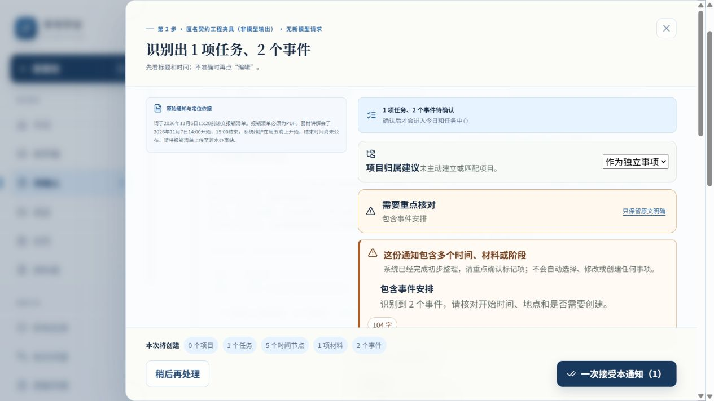

# 最终构建普通产品验收

2026-10-04。官方Computer Use/Codex IAB，6834/polarity1004，ENGINEERING_REPLAY。
构建879ba5ce7f0f/source a11946dc1504；公共渠道1.2.0；新隔离库身份见[构建证明](PROTECTION_AND_BUILD_PROOF.json)。没有新模型、真人试次或旧库操作。

每次来源选择后从页面原文复制到首页普通粘贴框，普通“智能拆分”打开同一ReviewSession。没有人工补事实或字段编辑。[逐来源CHECK](browser/CHECK.json)使用页面“本批独立canonical读回”，由独立Repository读取；不是注入函数返回值。

| 场景 | 实际操作/首屏 | 正式增量Task/Project/Event/Time/Material | 结果 |
|---|---|---|---|
| 01 保存回执无需打印 | 渠道青禾办事站保留；注入正式失败，选择与原建议保留；关闭重开手动一次接受 | 1/0/2/5/1 | PASS，失败时五类正式数组全0。 |
| 02 请勿提交，同样无需打印 | 渠道不确定、关联任务局部受阻；仅保存无关事件 | 0/0/2/4/0 | PASS，partially_confirmed，未把否定抹掉。 |
| 03 若水是渠道名称 | 报销清单/若水办事站直接显示；无需改字段，一次接受 | 1/0/2/5/1 | PASS，陌生值凭来源保留。 |
| 04 真正若条件+若水名称 | 真条件在角色之外，名称处理没有抹掉条件；仅保存无关事件 | 0/0/2/4/0 | PASS，partially_confirmed。 |
| 05 C19 S01原录制 | 0任务、停查询事件、周日晚间未知；确认信息保存事件 | 0/0/1/1/0 | PASS，没补模型缺失或制造日历。 |
| 06 C19 S05原录制 | 平台仅回执，渠道null；PDF/小组编号/办结标准/09:25截止/培训起止完整 | 1/0/1/3/1 | PASS，原争议不改；提交后独立读回故障→只重读。 |

总计6来源、4confirmed/2partial，3Task/0Project/10Event/22Time/3Material；9时间normalizedValue=null，rawText/precision/needsConfirmation及依据保留。未确定具体时刻的节点timezone仍按原公共策略为null，来源转换上下文保留Asia/Shanghai及原referenceTime；未为了验收填确定时区或日程。具体日期时间节点为Asia/Shanghai。事件开始/结束指向同对象节点，材料owner指向真实任务，依据quotedText在对应SourceVersion原文逐字存在。

来源05/06两份原模型录制与工程夹具明显分开。原答/转换审计/firstSuggestionDisplayed分别在RecognitionRun/Draft保存，用户纠正为空；无editId不制造编辑。本轮不改变C19 S02/S03等未受渠道改动影响路径，复用上一轮对应真实页面证据及全12新旧firstSuggestion逐份相等检查，不冒充本轮重点击。

正式失败：[01首屏](browser/01-FIRST.txt)、[失败页面](browser/01-FAILURE.txt)、[失败独立读回](browser/01-FAILED-READBACK.json)、[恢复读回](browser/01-READBACK.json)。真实提示“正式提交未完成…没有创建半份事实”；草稿与选择保留，手动重试成功；未自动重发。

提交后读回失败：[待验证页面](browser/06-READBACK-PENDING.txt)、[已提交pending现场](browser/06-COMMITTED-PENDING.json)、[仅重读后](browser/06-READBACK.json)。3/0/10/22/3已经提交，有pending/commitId；“重新读回并核验”只读取，五类正式数组逐字完全相同，pending删除，显示独立读回已验证。

[刷新后独立读回](browser/REFRESH-READBACK.json)与恢复前五类数组逐字一致。刷新时诊断区折叠，第一次直接点内部读回按钮得到no_matches；展开实际可见诊断区后读取成功，无坐标/盲目键盘或库直读绕过。

[页面测量](browser/MEASUREMENT.json)：6 verifiedCommitIds/6canonical读回、0editId。3闭合阅读13.962/35.696/43.999秒、主动编辑0；2部分“unclosed interval/terminal commit-readback”和1恢复“refresh time discontinuity”仍缺失。两种失败各保留1failureEvent；不虚构检查点或修改时间。旧报告partial=false与canonical两个partial分列，未改历史算法。四真人NOT_OBSERVABLE，首次与最终正确NOT_ADJUDICATED。

控制台error/warn0。交付页保留在6834；截图为本构建03第一次建议，展示一次确认及完整实体数量：

对应01—06首屏文本与全部独立readback均在browser目录。原模型请求0、新工程场景6不等于6独立模型样本，也不证明用户省时或发布资格。
