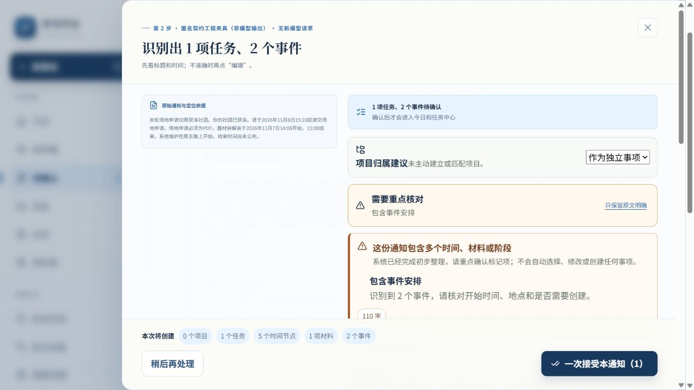

# 最终构建普通页面验收

官方Computer Use按可见DOM操作；全新端口6835、实例eligibility1004，未访问旧库。唯一入口http://127.0.0.1:6835/；库rco-mainline-01-02-i1-d27-plan-recorded-eligibility1004。构建2ab138c71580/source1211f91dc79b，完整源SHA及产物SHA见[构建证明](PROTECTION_AND_BUILD_PROOF.json)。12原录制+4工程反例；模型调用0。原相对时间使用录制referenceTime，Asia/Shanghai，不重解释成回放当天。

| 来源/实际操作 | 页面、失败分支与独立canonical结果 |
|---|---|
| 01获准场地申请 | 首次1任务+2事件可一次接受；注入正式事务失败，Task/Material/Event/Time/History均0。输入选择保留，关闭重开不改字，手动重试1Task/1Material/2Event/5Time；confirmed、只一个commit。 |
| 02获许可经费申请 | 首次同样可接受；注入提交成功后读回失败，显示“已提交，读回尚未验证”，重复提交关闭。关闭后独立读回已存在正式事实，再“重新读回并核验”；前后事实及history/commit一致，无盲重发。 |
| 03资格尚未公布 | 首次任务局部受阻；仅保存两个无关独立事件，0Task/0Material/2Event/4Time；partially_confirmed。unknown保持unknown。 |
| 04原答true但原文尚未获许可 | 资格矛盾被阻断，原答true保留；无关事件同上可部分保存，矛盾不转成执行任务。 |
| 05原C19 S03录制 | 两真实任务正式保存todo，递交登记依赖填写登记；前置未完成保持等待。第三资格未知任务仍受阻，部分确认；没有把unknown或等待写true/done。 |
| 06原C19 S02录制 | 0任务、2独立事件及4时间，同页正式确认；精确起止与模糊/未公布状态保留，不创建空项目。 |

最终6来源：4Task/0Project/2Material/10Event/22Time/30Evidence/38History，10时间null；3confirmed/3partially_confirmed，6唯一commit与6独立readback。事件正反引用、材料owner、任务依赖均核值，刷新六类canonical数组逐字相等；未知时间没有编造具体日历时刻。[逐来源事实、原答和独立核值](browser/CHECK.json)、[操作阶段](browser/STAGES.json)。

01失败、重开及02只读回的原始页面分别保留在browser/01-FAILURE.txt、01-REOPEN.txt、02-READBACK-FAILURE.txt；其他首次页01—06-FIRST.txt亦保留。验收中03曾在异步刷新完成前读到前一次页面JSON，STAGES明确标03-READBACK-STALE-PREVIOUS-UI-RETAINED/authoritative=false，不计PASS；随后03+04新独立读回及最终按source核值补证，旧错误证据保留。

6commit/readback、0editId、0input episode、0checkpoint：本轮没有编辑字段，不制造纠正。两个闭合时间墙钟13.288秒/78.855秒、activeEditMs=0；另四条为partial未闭合或关闭重开时间不连续，缺失保持null。正式失败和读回失败均保留trace；重试不计重复纠正。历史partial布尔outcome与真实canonical部分状态分列，未回填旧计算器。详见[测量记录](browser/MEASUREMENT.json)与CHECK摘要。四项真人NOT_OBSERVABLE，首次整份NOT_ADJUDICATED；自动化耗时不称真人省时。最终浏览器console warning/error为空。

[刷新后的实际普通首页](browser/FINAL-PAGE.png)。截图不替代独立Repository读回；旧入口证据不替代本轮最终构建。运行方式：`node scripts/serve-candidate19-recorded.mjs 6835 eligibility1004 --eligibility-fixtures`，本次已运行；重启服务须选新的实例名，不能复用已建库冒充新试次。
