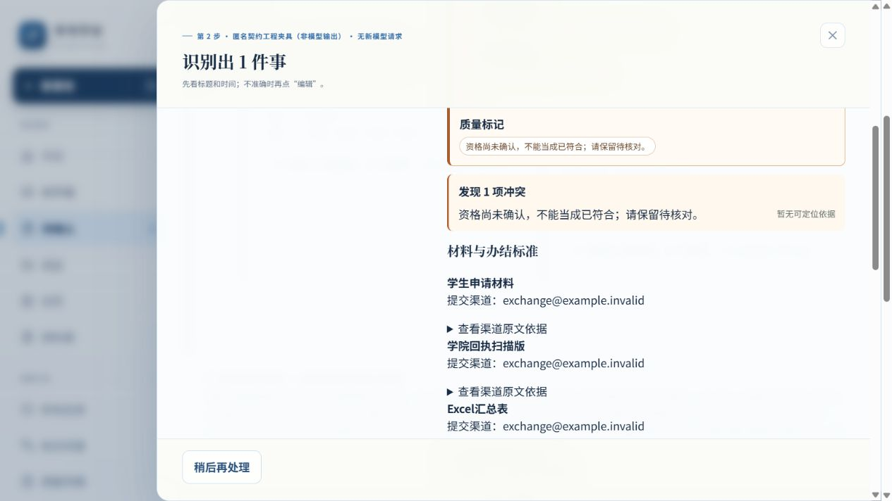

# 当前浏览器证据入口

当前唯一入口6840、publicpaid1004库；1份本批已知实际录制及3份历史控制的最终构建、失败恢复、部分确认与刷新独立读回见[本轮浏览器](paid-evidence/BROWSER_EVIDENCE.md)和[CHECK](paid-evidence/browser/CHECK.json)。下方6836/public1004仅保留授权前历史工程验收，不能代替新录制，也不是当前推荐入口。

---

# 最终产品构建实际浏览器

官方computer-use/CUA In-app browser，tab14；http://127.0.0.1:6836/。全新库rco-mainline-01-02-i1-d27-plan-recorded-public1004；构建0bcc3b8b9263/source53d0b9c7c4c1，HEAD是构建时起点，source是本轮实际待提交产品源。源/静态SHA与提交原字节后验见PROTECTION_AND_BUILD_PROOF；旧6835未访问。所有记录ENGINEERING_REPLAY，真人NOT_RUN，模型机械关闭。

| 实际路径 | 结果及独立证据 |
|---|---|
| 公开暂停摘录工程wire，首次0任务1事件 | 01-pause-first.txt/png。直接确认后01-pause-readback.json：0Task0Project1Event2Time；精确跨日端点、owner、依据正确；无edit。 |
| 公开材料摘录工程wire | 02-material-first.txt/png、11-final-material.txt/png。三种共用渠道保留、PDF/命名/公章/Excel/截止保留；意向unknown待核对。未强行确认，正式0新增；关闭/刷新重开首屏仍完整。 |
| 原C19 S05事务故障 | 03-transaction-failure.txt/png为异步失败后的权威提示；03-failure-readback.json只有已确认暂停1Event2Time、Task0，草稿/选择仍在。关闭重开手动一次接受成功；04-recovered-readback.json新增1Task1Material1Event3Time，渠道null/原推测保留、完成标准/PDF/命名未丢。 |
| 原C19 S02未知时间/读回故障 | 05-vague-first.txt；06-readback-failure.txt/png明确已提交但读回未验证，确认按钮禁用。06-pending-readback.json实际已有两个事件四个时间。点击仅重新读回→07-verified-readback.json，事实数量相同，没有重发正式事务。周五夜间/尚未公布都null、vague、真实event owner。 |
| 原C19 S03局部确认/前置等待 | 08-dependency-partial-first.txt、08-partial-readback.json。保存填写、递交两个任务，dependencyIds为真实填写Task，填写仍todo；资格未知领取项未入库，draft partial。 |
| 刷新/来源隔离 | 09-refresh-readback.json与刷新前任务和Time逐字相等。3Task0Project1Material4Event9Time；所有entity owner/依据指向本库真实SourceVersion，没有访问旧库。API派发/同步403见ISOLATION。 |
| 测量 | 10-measurement.json和CHECK。5来源4commit/readback/0edit，2失败/1restore；2完整区间active0，3缺失。没有制造editId、补0或把旧partial布尔改成成功。 |

几次CUA动作未成功的原始情况：getByLabel未匹配来源select，改用已观察到的combobox；错误value101没有匹配选项，随后按页面真实label选择；稍后处理导航到待确认，必须回首页；刷新会关闭工程details，因此展开后再取读回。均没有盲坐标、改IndexedDB或读取隐藏浏览器状态；这些是定位/可见性错误，没有当作产品成功证据。

坏图局部阻断、同源CAS/字段冲突未受本次渠道匹配修改影响，沿用eligibility-followup已验证产品底座及既有测试；本轮不声称重新点完全部历史矩阵。未知个人意向尚未正式确认，是安全边界。本轮没测真人速度、首次模型正确率或完整官网正文。

