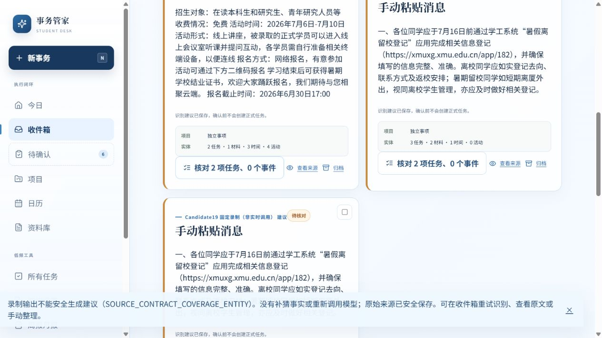

# 最终实际普通页面与独立读回

官方Computer Use实际点击，新库原4录制。唯一入口http://127.0.0.1:6855/，d8fde20f94f9 / source d226a74a307a，库rco-mainline-01-02-i1-d27-plan-recorded-current-real-final1005。浏览器不调用模型，两个api POST均403，见BROWSER_HTTP.json；未修改旧6851/6852。

| 实际操作 | 结果 | 证据 |
|---|---|---|
| 原冻结四首屏 | 01/04图拒绝；02入口被清空；03结束null/vague/title待核对 | browser/before-01..04.txt部分为差分，只作过程证据；完整确定转换BEFORE.json |
| 最终02及部分确认 | 应用/URL保留，基本项可存，另两unknown不预选 | browser/final-02-first.txt、final-canonical.json，两material同渠道，7/16日前/date_only |
| 明确armed正式失败 | 新故障来源RECORDED_INJECTED_FORMAL_SAVE_FAILURE，只有前一正常来源Task1/Material1/Time1，无半份新事实 | browser/formal-failure.txt、formal-failure-canonical.json |
| 手动重试提交后读回失败 | 同一来源commit保留，显示已提交但未验证，不盲目再次接受 | browser/readback-failure.txt |
| 关闭/刷新后仅读回 | 收件箱重新读回成功，Task2未增至3，pending0，同commit | browser/readback-recovered.json、final-canonical/measurement |
| 最终03首屏及事务/刷新 | E1 title和7/6→7/10/date_only正确、同owner；整体按钮存4事件，额外3事件仍错误，两个任务未确认 | browser/final-03-first.txt、source3-saved.json、final-03-refresh.txt。不是正确单事件处置PASS |
| 最终01/04 | 实际普通输入拒绝原错误码，来源仍在，正式Task/Event未增加 | browser/final-01-rejected.txt、final-04-rejected.txt、final-canonical.json |
| 安排 | 原7月截止不改，10月回放显示逾期需明确改期，0可安排时段 | browser/planning-refresh.txt；新未来可行时段接受未测 |

第一次弹层打开时背景注入控件未armed，随后的正常保存不算故障验收；之后关闭弹层、确认故障生效才走真正失败。只读恢复也在关闭弹层后操作，未用隐藏脚本改库。

最终Task2/Material2/TimePoint4/Event4/Project0；02正常capture和独立故障capture各1Task，非重试重复；3来源部分确认、2失败。03额外事件保留错证据，普通事件区无逐个拒绝，本轮未新增此第三改造，不称正确。

测量见browser/measurement.json、BROWSER_SUMMARY.json：pageEditIds全[]，3verifiedCommitIds，故障来源2failureEvents，刷新/未闭合计时null/missing。打开事件编辑后没改字并明确放弃，未造纠正。旧ordinary.partial=false原样，canonical三个partially_confirmed另列。ENGINEERING_REPLAY，四真人NOT_OBSERVABLE，不估算省时。

