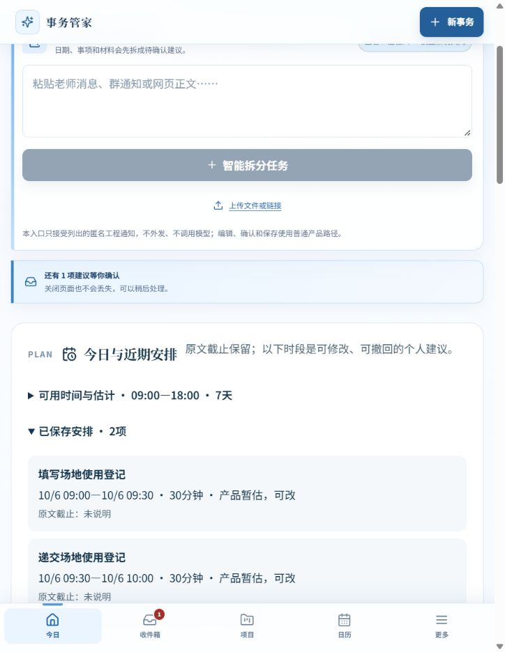

# 普通产品路径：最终运行包验收

2026-10-05。唯一当前入口：http://127.0.0.1:6851/。
数据库rco-mainline-01-02-i1-d27-plan-recorded-currentnoticefinal1005；ENGINEERING_REPLAY。
实际构建d2b0cc6800cc / source 97e42e786c60；候选固定C17/C19录制，另两份手写契约明确非模型。公共时间2.1.0/首次组装1.1.0显示在来源区。代码最后两处类型注解/移除无用export未影响运行字节：[最终JS/CSS逐字哈希相同](FINAL_BUNDLE_EQUIVALENCE.json)，没有用旧证据代替改动路径。

启动命令：node scripts/serve-candidate19-recorded.mjs 6851 currentnoticefinal1005 --current-notice-fixtures。已有实例禁止重建；未来重建要新端口和新实例。菜单含1当前确定录制、12历史控制、2工程契约，共15条；不是15个本轮模型样本。

| 验收 | 实际页面行为 | 独立正式事实证据 | 结果 |
|---|---|---|---|
| 日期/时段分行、无任务事件 | 首屏10月12日12:30至14:00；0编辑，一次确认 | CANONICAL_HEADING.json：0Task/0Project/1Event/2Time；event_start/end值、owner和依据齐全 | PASS |
| 24点截止 | 原文6月30日24:00保留，截止保存为7月1日00:00 | CANONICAL_PENDING_READBACK.json、AFTER.json | PASS |
| 正式事务失败 | 页面说明未提交、无半份事实；草稿/选择保留 | CANONICAL_FORMAL_FAILURE.json：仍0Task/1Event/2Time；新增报名任务0 | PASS |
| 手动恢复后提交成功但读回失败 | 明确“已提交，读回尚未验证”；禁重复提交；手动仅重新读回 | BROWSER_READBACK_FAILURE.txt、BROWSER_RECOVERED.txt；同commit，报名Task1/截止1，无重复 | PASS |
| 依赖/资格局部阻断、部分确认 | S03前2项一次接受；第2保留等待；第3unknown资格未强行加入 | CANONICAL_PARTIAL.json：2义务，第二dependency指向第一，第一仍todo；draft.partially_confirmed | PASS |
| 精确截止、材料与办结标准 | S05无需补渠道；PDF/命名/回执原文保留；任务和事件一次保存 | CANONICAL_MATERIAL.json：材料PDF、小组编号、submissionChannel=null；截止11/13 09:25，事件11/14 14:20→15:35，正确owner | PASS |
| 模糊/未公布、无任务双事件 | S02首屏显示精确说明会及网络调试未知；可直接确认信息 | CANONICAL_BEFORE_REFRESH.json：原文“周五夜间开始”“恢复时间尚未公布”，null/vague/needsConfirmation；0新增任务 | PASS |
| D27最小安排 | 填写10/6 09:00–09:30，递交09:30–10:00；各30分钟标产品暂估；需接受 | CANONICAL_PLAN.json、BROWSER_PLAN_SAVED.txt：2个人planned_start；原截止未说明；todo和依赖不变。逾期报名未新安排 | PASS |
| 刷新/独立读回 | 刷新后展开工程读回区，通过另一Repository读取 | REFRESH_CHECK.json：九类集合逐字相同；最终4Task/0Project/4Event/1Material/12Time（10原文+2个人安排）/23Evidence | PASS |
| 计量与无编辑 | 5个来源commit/readback各5；2失败原记录，0edit，无假editId | MEASUREMENT.json、ENGINEERING_SUMMARY.json：3完整时间/2缺失，完整墙钟中位8464ms仅工程；4完整确认/1canonical部分确认 | PASS，终态/时间限制如实保留 |

本轮没有新增检查点/编辑恢复实现，旧未受影响的检查点失败、关系错引用保护、双身份/双标签冲突可复用paid-evidence/fact-followup及后续既有记录；新定向反例另实际走Schema/转换/正式Repository。**未声称本次重新点击完整旧矩阵或真人验收。**

工具与过程错误：初次6850误走旧C19场景入口，报C19_RECORDED_UNRESOLVED_STATE；改为现有public read-only场景承载新夹具，不改封存状态。6850新试验库保留，未当最终验收。官方浏览器数次locators deadline/无匹配发生在工程区收起或页面重绘；先重读DOM，再展开/语义选择完成；未盲按键。一次读回按钮点击后JSON尚空，保留过程错误，读最新完成DOM后再取，不称失败时已验证。没有外部登录/验证码绕过。

手写wire第一次缺usage/model/资格证据等构造失败保留FIXTURE_SETUP_ERRORS*.json。最终合法BEFORE才作为转换缺口，不将构造错误当Candidate19生成错误。一次变日期反例错用录制rebinder被合理拒；改为明确新手写counterfactual映射，原raw未改。

[ISOLATION](ISOLATION.json)验证回环，/api/deepseek、/api/sync、/dispatch的POST均403。未访问旧6841、6792、6798或旧用户库。BROWSER_LOGS.json无error/warn。初始来源引用原referenceTime，未改成当天。模型原答、转换和第一次显示留RecognitionRun/草稿；后续0人工事实修改。

四项真人指标仍NOT_OBSERVABLE；工程秒数不证明真人省时，工程保存成功不证明模型整份正确。
