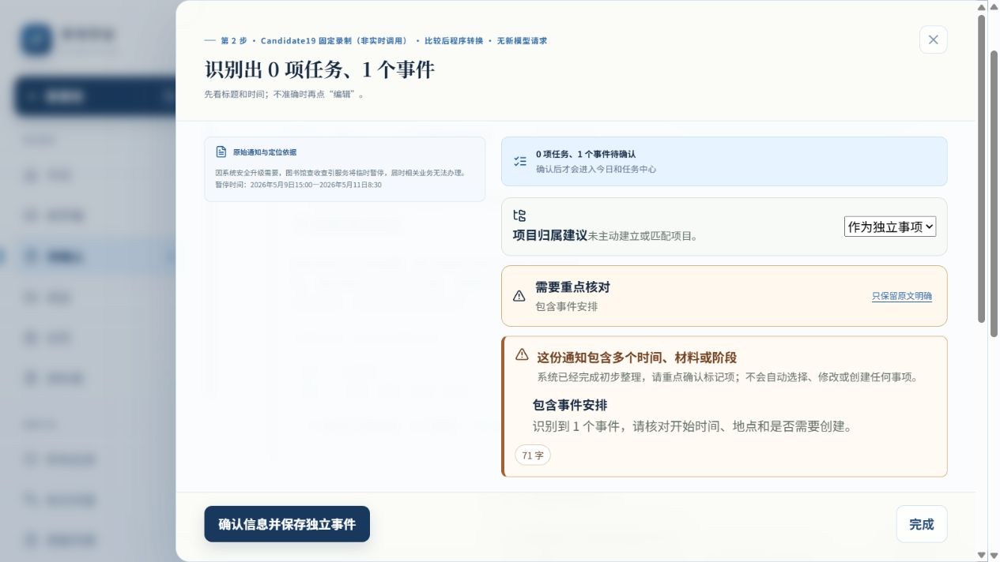

# 新录制在最终产品构建的实际浏览器

官方Computer Use/CUA，In-app tab15，http://127.0.0.1:6840/。固定录制/ENGINEERING_REPLAY，派发机械关闭；构建e32462ef85c9 / source b6881247af86，新库rco-mainline-01-02-i1-d27-plan-recorded-publicpaid1004。旧6836库未操作。构建源和静态文件身份见browser/CHECK.json；原12仅历史回归，当前付费批固定4分母。

| 实际操作 | 页面与独立事实证据 |
|---|---|
| PUB1复制原文→智能拆分 | 01-first-suggestion.txt/png：首次0任务1事件，May9 15:00→May11 08:30，无人工补录。02-before-confirm.json正式0T0P0E0Time，来源/草稿先持久化。 |
| 注入正式事务失败→确认 | 03-formal-failure.txt明确没有半份事实；03-formal-failure-readback.json正式0，源/草稿保留。关闭重开手动确认→04-public-saved.json，0T0P1E2Time，owner/原文依据/值完整。 |
| C19旧S02准确+未知起止 | 05-unknown-first.txt：2事件4时间，exact两点、周五夜间/尚未公布null。06-committed-readback-pending.txt“已提交，读回尚未验证”，确认禁用。仅重新读回→07-after-readback-only.json，合计3事件6时间、没有第二提交；事实稳定。 |
| C19旧S03部分确认 | 08-dependency-first.txt、09-partial-confirmed.txt：保存填写和递交两任务，递交等待前置、填写仍todo，资格unknown领取项不入库；canonical draft partially_confirmed。 |
| C19旧S05材料/截止 | 10-material-first.txt：1Task1Event3Time1Material；PDF、命名、办结保留，“平台”原推测、正式渠道null；正式一次接受→11-final-canonical.json。 |
| 刷新并重新读取 | 13-after-refresh.json与11全图九个事实集合逐字相等，14-refresh-check.json。3T0P1Material4Event9Time，3confirmed/1partial；未知两个null，不把计划日期写成deadline。 |
| 工程测量 | 12-measurement.json：0edit、4已验证commit/readback、失败成本保留；S02/S05闭合activeEdit0，PUB1刷新断点/S03未闭合缺失为null。部分状态按canonical单列，旧计量布尔不改。 |
| 隔离/控制台 | GET/POST /api/deepseek及POST /api/sync均403，browser/CHECK；15-console.json空错误/警告。 |

06-committed-readback-pending.json是异步读回尚未刷新时读取的前一来源旧pre，明确NOT_USED_AS_PENDING_COMMIT_PROOF；不冒称它证明提交后数量。真正只重读恢复证据是06页面pending提示→07独立结果。CUA几次定位deadline来自未匹配控件名、刷新后工程details折叠及异步未出控件；按实际DOM纠正，未盲按键、改IndexedDB或绕过UI。验收结果以保存后的fresh DOM和独立pre为准。

未改来源/坏图/冲突底座，沿用当前测试及以前受保护底座证据，不称本轮点击全部历史矩阵。没有真人、省时或完整四来源正确率。无字段修改就无editId，工程操作不能代真实参与者。

