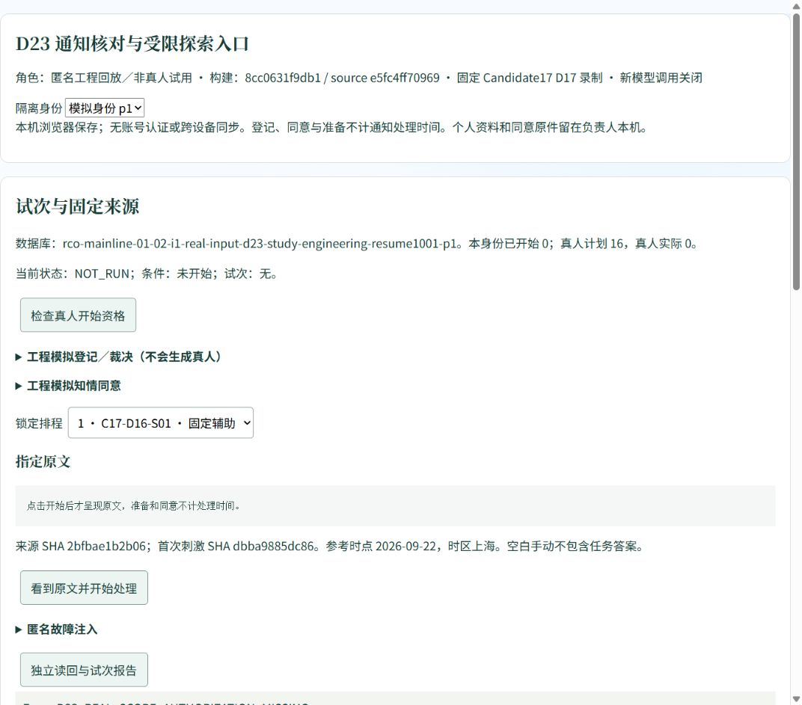

# D23 工程入口恢复回执

2026-10-01。用户明确选择“本轮只恢复工程入口”。状态 **D23_ENGINEERING_ENTRY_RESTORED**；真人条件仍未满足，本次没有创建试次或真人授权。

当前唯一推荐入口：[D23 本机工程回放](http://127.0.0.1:6730/?automation=1)。服务绑定回环地址，使用全新 `engineering-resume1001-p1`—`p4` 数据库；旧 6725/final01 入口及其浏览器数据保留。页面是固定 Candidate17 D17 录制与空白手动条件，实时模型派发关闭。该地址只有本机服务运行时可用，不是云端部署。

## 本次实际完成

- 从干净分支 `codex/e2-candidate11-blind-eval`、HEAD/upstream/远端 `8cc0631f9db1bdd363fa6e4cd1b42641ea0bd493` 核验起点；没有回滚 D22/D23 或用户改动。
- 重新构建现有入口，页面构建 `8cc0631f9db1 / source e5fc4ff70969`。完整 source SHA 为 `e5fc4ff70969d369f5299c245579309ac434c5757672421befc15c830fd192d9`。与旧 D23 构建不同是因为后续已提交的云端工具改变全目录指纹，不是新候选效果；产品代码本轮未改。
- 8 份来源、8 份原始辅助录制、8 份手动空白封套、16 个排程位置均验证。冻结计划 SHA 仍为 `2f2d39da1c9b75d22726cafa2c648f7ec4d83d79ed2d8e422893e77f42e9a4a0`。
- 官方浏览器实际打开页面；检查真人资格返回 `D23_REAL_SCOPE_AUTHORIZATION_MISSING`，缺负责人/冻结/同意时开始被 `D23_CONSENT_FREEZE_OWNER_REQUIRED` 拒绝。两次检查都没有创建试次。
- 页面分别通过独立 Repository 读回 p1/p2：来源、草稿、任务、项目、事件、材料、时间、证据和历史均为 0；物理库身份不同。四身份报告实际重建并汇总为 0 已开始、真人指标 `NOT_OBSERVABLE`。这是本次空库绑定/读回检查，不冒充重跑带事实的完整隔离验收。
- D23 22 项与历史 measurement 4 项，共 **26 项定向 PASS**；D23 构建、材料与隔离 verify PASS；D19 旧输出诊断 verify PASS。84 份保护、119 份冻结文件保留；权威账本仍为 938 行、SHA `e79aec8bbb1378e37f3941d8ffac9cce7d74bbb8e11d7ceee5c90a88b6c734b9`。

安全扫描通过（3252 个源文件及构建文件），Git diff 检查通过。本轮只有服务恢复、证据和活动交接更新，没有产品代码变化，不重复全量 lint/test/build；此前全量 11 组通过/4 组历史失败仍按 [原验证](../VALIDATION.md) 解释，不改写为全量通过。原 D23 的 13 条工程开始、4 条完成候选、1 条 partial、8 条退出属于旧库历史，本次新库不复制、不回填。

本轮业务模型、grant/reserve/settle、真人、默认替换、合并和部署均为 0。四项真人指标继续缺失；manual 的首次模型建议与低修改建议收益不适用。没有新的识别率或省时结论。

## 使用和重启

入口已打开并保留在应用浏览器。当前没有预填模拟负责人、同意或裁决，直接点击开始会提示缺项；工程模拟与真人登记在页面上明确区分。用户如需操作工程模拟，可按原文在工程登记区核准材料并登记模拟同意；不能将这些工程记录改成真人数据。

服务关闭后在该工作区运行：

```powershell
node scripts/serve-d23-study.mjs 6730 resume1001
node scripts/verify-d23-study.mjs .data/d23/resume1001
```

端口占用时保留原服务，不杀其他进程；需要新的隔离回放时选新端口和实例，不清空旧库。浏览器保留数据的前提是继续使用同一浏览器、站点地址和数据库身份。

未来真实探索仍需另行明确 4 人 16 条本机固定录制范围、真实负责人接受和参与者本人同意；首人前核准既有义务、争议、刺激与测量口径。本次用户选择只恢复入口，因此不进入真人部分。

证据见 [结构化回执](RECEIPT.json)；原始页面读回 JSON 位于忽略目录 `.data/d23/resume1001`，回执保留哈希。下图是本次实际浏览器画面，原历史截图未修改。


